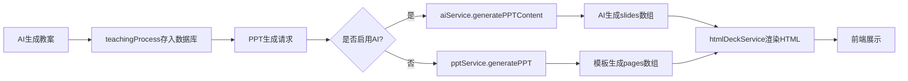
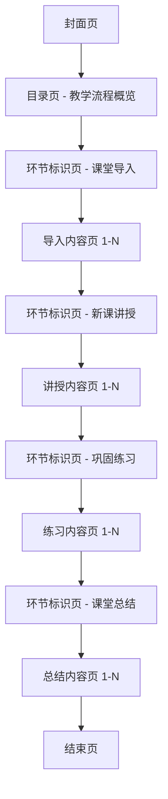

# 基于教学过程的PPT生成方案设计

## 一、现状分析

### 1.1 当前数据流



### 1.2 当前PPT生成的核心问题

| 问题 | 现状 | 影响 |
|------|------|------|
| **缺乏教学过程结构** | slides是扁平的知识点列表，无教学环节分组 | 教师无法按教学节奏使用PPT |
| **禁止展示教学设计信息** | systemPrompt明确禁止教学目标、重难点等页面 | PPT变成纯知识展示，失去教学引导功能 |
| **teachingProcess数据利用率低** | 仅作为文本块传入AI，未利用其结构化数据 | 教学过程的环节信息被浪费 |
| **无环节过渡标识** | 所有页面视觉上无区分 | 教师在课堂中难以定位当前教学环节 |
| **新旧格式不兼容** | 教案AI生成的是结构化JSON，手动输入可能是纯文本 | PPT生成需要同时处理两种格式 |

### 1.3 现有页面类型

当前AI PPT支持7种类型：`cover`、`content`、`example`、`thinking`、`summary`、`practice`、`end`

### 1.4 教案teachingProcess数据结构

教案AI生成的结构化格式（来自`lessonPlanService.js`第36-61行）：

```json
{
  "introduction": {
    "duration": "5分钟",
    "activities": ["导入活动描述"]
  },
  "newTeaching": {
    "duration": "30分钟",
    "stages": [
      {
        "stageName": "环节名称",
        "duration": "环节时长",
        "teacherActivities": ["教师活动"],
        "studentActivities": ["学生活动"],
        "teachingPoints": ["教学要点"],
        "timeAllocation": "时间分配"
      }
    ]
  },
  "practice": {
    "duration": "5分钟",
    "activities": ["练习活动"]
  },
  "summary": {
    "duration": "5分钟",
    "activities": ["总结活动"]
  }
}
```

手动输入的简化格式（来自`pptService.js`第51-62行）：

```json
{
  "introduction": "课堂导入内容描述",
  "mainContent": "新课讲授内容描述",
  "practice": "巩固练习内容描述",
  "summary": "课堂总结内容描述"
}
```

---

## 二、新方案设计

### 2.1 核心设计理念

**从"知识展示型PPT"转变为"教学过程引导型PPT"**

PPT不再是一个个独立的知识点幻灯片，而是按照教学过程的四个环节（导入→新授→练习→总结）组织的结构化教学工具。每个环节有一组页面，环节之间有明确的过渡标识，教师可以在课堂上清晰地按照教学节奏使用PPT。

### 2.2 新PPT页面结构



### 2.3 页面类型设计

#### 保留的现有类型（4种）

| 类型 | 用途 | 调整说明 |
|------|------|----------|
| `cover` | 封面页 | 保留，增加教学环节概览信息 |
| `content` | 内容页 | 保留，作为各环节内的主要内容载体 |
| `example` | 案例页 | 保留，用于新课讲授环节中的案例展示 |
| `end` | 结束页 | 保留 |

#### 新增的类型（4种）

| 类型 | 用途 | 说明 |
|------|------|------|
| `toc` | 教学流程目录页 | 展示四个教学环节的流程概览，替代原来的纯内容目录 |
| `section` | 环节标识页 | 每个教学环节的起始页，标注环节名称、时长、目标 |
| `thinking` | 思考/讨论页 | 用于新课讲授中的引导思考（保留原有类型，明确用途） |
| `practice` | 练习页 | 用于巩固练习环节中的具体练习题（保留原有类型，明确用途） |

#### 不再使用的类型

| 类型 | 说明 |
|------|------|
| `summary` | 不再作为独立的知识总结页，而是合并到"课堂总结"环节中 |

#### 最终页面类型清单（8种）

1. **`cover`** - 封面页
2. **`toc`** - 教学流程目录页（新增）
3. **`section`** - 环节标识页（新增）
4. **`content`** - 内容页（核心知识/要点）
5. **`example`** - 案例页（典型例题/案例分析）
6. **`thinking`** - 思考页（思考题/讨论题）
7. **`practice`** - 练习页（课堂练习/即时检测）
8. **`end`** - 结束页

### 2.4 页面结构示例

以一节初中物理"光的折射"为例，展示新方案的页面结构：

```
第1页  [cover]    封面 - 光的折射
第2页  [toc]      教学流程概览（导入3min → 新授25min → 练习10min → 总结7min）
第3页  [section]  📍 课堂导入（5分钟）- 激发兴趣，引入课题
第4页  [content]  导入：生活中的折射现象（图片+问题引入）
第5页  [section]  📍 新课讲授（30分钟）- 核心知识讲解
第6页  [content]  光的折射定律：三线共面、两线分居、角度关系
第7页  [content]  折射率的定义与计算公式
第8页  [example]  案例：水中筷子看起来弯折的现象分析
第9页  [thinking] 思考：为什么海市蜃楼会出现？
第10页 [content]  折射定律的数学表达与Snell定律
第11页 [section]  📍 巩固练习（5分钟）- 知识运用与检测
第12页 [practice] 练习1：判断光线折射方向
第13页 [practice] 练习2：计算折射角
第14页 [section]  📍 课堂总结（5分钟）- 回顾与升华
第15页 [content]  本节课知识框架总结
第16页 [end]      结束页
```

### 2.5 各页面类型的content数据结构

```json
// cover 封面页
{
  "type": "cover",
  "title": "课程标题",
  "content": {
    "mainTitle": "课程标题",
    "subtitle": "七年级 - 物理"
  },
  "layout": "cover",
  "notes": "教师备注"
}

// toc 教学流程目录页
{
  "type": "toc",
  "title": "教学流程",
  "content": {
    "stages": [
      { "name": "课堂导入", "duration": "5分钟", "icon": "🎯" },
      { "name": "新课讲授", "duration": "30分钟", "icon": "📖" },
      { "name": "巩固练习", "duration": "5分钟", "icon": "✏️" },
      { "name": "课堂总结", "duration": "5分钟", "icon": "📋" }
    ]
  },
  "layout": "toc",
  "notes": "展示本节课的教学流程和时间分配"
}

// section 环节标识页
{
  "type": "section",
  "title": "新课讲授",
  "content": {
    "sectionName": "新课讲授",
    "duration": "30分钟",
    "objective": "理解光的折射定律，掌握折射率的计算方法",
    "icon": "📖"
  },
  "layout": "section",
  "notes": "新课讲授环节开始"
}

// content 内容页
{
  "type": "content",
  "title": "光的折射定律",
  "section": "新课讲授",
  "content": {
    "items": [
      { "number": 1, "text": "折射光线、入射光线和法线在同一平面内" },
      { "number": 2, "text": "折射光线和入射光线分居法线两侧" },
      { "number": 3, "text": "当光从空气斜射入水中时，折射角小于入射角" }
    ],
    "layout": "list"
  },
  "layout": "content",
  "notes": "详细讲解折射定律的三个要点"
}

// example 案例页
{
  "type": "example",
  "title": "水中筷子弯折现象",
  "section": "新课讲授",
  "content": {
    "items": [
      { "number": "现象", "text": "将筷子插入水中，水面下的部分看起来向上弯折" },
      { "number": "原因", "text": "光从水中斜射入空气时发生折射，折射角大于入射角" },
      { "number": "结论", "text": "人眼逆着折射光线看去，看到的是筷子的虚像，位置比实际偏高" }
    ],
    "layout": "list"
  },
  "layout": "example",
  "notes": "结合图片展示折射现象"
}

// thinking 思考页
{
  "type": "thinking",
  "title": "海市蜃楼的成因",
  "section": "新课讲授",
  "content": {
    "items": [
      { "number": "问题", "text": "海市蜃楼是如何形成的？它与光的折射有什么关系？" },
      { "number": "提示", "text": "考虑不同高度空气密度不同导致的折射率变化" },
      { "number": "讨论", "text": "小组讨论2分钟，然后分享你们的思考" }
    ],
    "layout": "list"
  },
  "layout": "thinking",
  "notes": "引导学生运用折射知识解释自然现象"
}

// practice 练习页
{
  "type": "practice",
  "title": "课堂练习",
  "section": "巩固练习",
  "content": {
    "items": [
      { "number": 1, "text": "画出光从空气斜射入玻璃时的折射光线方向" },
      { "number": 2, "text": "已知入射角为30°，玻璃折射率为1.5，求折射角" }
    ],
    "layout": "list"
  },
  "layout": "practice",
  "notes": "学生独立完成，教师巡视指导"
}

// end 结束页
{
  "type": "end",
  "title": "谢谢观看",
  "content": {
    "mainText": "感谢聆听",
    "subText": "欢迎交流讨论"
  },
  "layout": "end",
  "notes": ""
}
```

### 2.6 新AI Prompt设计

#### systemPrompt 核心变更

**关键变化：**
1. 移除"禁止展示教学设计信息"的限制
2. 增加`section`类型的幻灯片定义
3. 要求AI严格按照教学过程的四个环节组织slides
4. 每个环节以`section`类型页面开头
5. 增加`toc`页面生成要求

#### 新systemPrompt模板

```
你是一位资深的教学设计师和PPT视觉设计专家，专门为课堂教学设计高质量的演示文稿。

你的核心任务：严格按照教案的教学过程设计，生成结构化的课堂PPT。PPT的结构必须与教学过程完全对应——每个教学环节对应一组幻灯片，环节之间有清晰的过渡标识。

【核心原则】
1. PPT结构必须严格对应教学过程的四个环节：课堂导入→新课讲授→巩固练习→课堂总结
2. 每个教学环节必须以"section"类型页面开头，标注环节名称和时长
3. 同一环节内的幻灯片必须在title中体现所属环节（通过section字段标注）
4. 这是学生在课堂上看到的投影课件，内容要详实、重点突出

【教学过程与页面的对应关系】
- 课堂导入环节：设计1-2页幻灯片，用于情境创设、问题引入、激发兴趣
- 新课讲授环节：设计4-8页幻灯片，覆盖所有核心知识点，包含概念讲解、案例分析、思考讨论
- 巩固练习环节：设计1-3页幻灯片，包含课堂练习和即时检测
- 课堂总结环节：设计1-2页幻灯片，包含知识框架回顾和要点总结

【幻灯片类型】
- cover: 封面页（课程标题+年级学科）
- toc: 教学流程目录页（展示四个环节及时间分配）
- section: 环节标识页（标注环节名称、时长、目标）
- content: 内容页（核心知识点、关键概念）
- example: 案例页（典型例题、案例分析）
- thinking: 思考页（思考题、讨论题）
- practice: 练习页（课堂练习、即时检测）
- end: 结束页

【严格禁止】
- 禁止将教学目标、教学重难点、教学方法、教师活动、学生活动等作为独立页面内容
- 禁止出现课后作业页面
- 禁止出现教学反思页面
- 这些信息仅供你设计内容时参考，你应该将它们转化为具体的课堂展示内容

请用严格的JSON格式返回：
{
  "slides": [
    {
      "type": "cover|toc|section|content|example|thinking|practice|end",
      "title": "幻灯片标题",
      "section": "所属教学环节（仅content/example/thinking/practice类型需要）",
      "points": ["要点1", "要点2", ...],
      "notes": "演讲者备注",
      "imageKeywords": "英文配图关键词"
    }
  ]
}

【图片关键词要求】
- 每个页面的imageKeywords字段用于自动搜索配图
- 使用英文关键词，2-3个词，简洁准确
- cover页：使用学科相关的主题图片关键词
- content/example页：使用与知识点相关的具体图片关键词
- thinking页：使用引发思考的图片关键词
- section/toc/practice/end页：可以留空字符串""

【重要提醒】
- slides数组中的第一个元素必须是type为"cover"的封面页
- 第二个元素必须是type为"toc"的教学流程目录页
- 最后一个元素必须是type为"end"的结束页
- 每个教学环节（导入/新授/练习/总结）的第一个页面必须是type为"section"的环节标识页
- section页面的content中必须包含sectionName、duration、objective字段
- 只输出JSON，不要输出任何其他文字
```

#### 新userPrompt模板

```
请根据以下${subject}（${grade}）教案的教学过程设计，生成一份结构化课堂PPT：

【课程信息】
- 课题：${title}
- 学科：${subject}
- 年级：${grade}

【教学目标】（仅供设计参考，不要作为独立页面展示）
${goals}

【教学重难点】（仅供设计参考，不要作为独立页面展示）
${points}

【教学过程】（PPT结构必须严格对应以下环节）

1. 课堂导入（${process.introduction.duration || '5分钟'}）
${process.introduction.activities}

2. 新课讲授（${process.newTeaching.duration || '30分钟'}）
${process.newTeaching.stages.map(s => `- ${s.stageName}: ${s.teachingPoints.join('；')}`).join('\n')}

3. 巩固练习（${process.practice.duration || '5分钟'}）
${process.practice.activities}

4. 课堂总结（${process.summary.duration || '5分钟'}）
${process.summary.activities}

【设计要求】
1. PPT结构必须严格按照教学过程的四个环节组织
2. 每个环节以section页面开头，包含环节名称、时长和教学目标
3. 课堂导入环节：设计1-2页，聚焦情境创设和问题引入
4. 新课讲授环节：每个教学阶段(sstage)设计1-2页，覆盖所有teachingPoints
5. 巩固练习环节：设计1-3页，将practice.activities转化为具体练习题
6. 课堂总结环节：设计1-2页，以知识框架或要点回顾的形式总结
7. 内容要充实详细，每个知识点要深入展开
8. 确保PPT内容足够详细，学生仅通过PPT就能理解本节课的核心知识
```

### 2.7 教案数据适配层

由于teachingProcess存在两种格式（结构化JSON和纯文本），需要一个适配层来统一处理：

```javascript
/**
 * 教案teachingProcess数据适配器
 * 将不同格式的teachingProcess统一为结构化格式
 */
class TeachingProcessAdapter {
    /**
     * 将teachingProcess统一为结构化格式
     * @param {string|object} teachingProcess - 教案中的teachingProcess字段
     * @returns {object} 结构化的教学过程数据
     */
    static normalize(teachingProcess) {
        // 如果已经是结构化格式（AI生成的教案）
        if (typeof teachingProcess === 'object' && teachingProcess !== null) {
            if (teachingProcess.introduction && typeof teachingProcess.introduction === 'object') {
                return this.normalizeStructured(teachingProcess);
            }
            // 简化格式 { introduction: "文本", mainContent: "文本", ... }
            return this.normalizeSimple(teachingProcess);
        }

        // 如果是JSON字符串
        if (typeof teachingProcess === 'string') {
            try {
                const parsed = JSON.parse(teachingProcess);
                return this.normalize(parsed);
            } catch {
                // 纯文本格式
                return this.normalizeText(teachingProcess);
            }
        }

        // 空值
        return this.getDefault();
    }

    /**
     * 标准化结构化格式（AI生成的完整教案）
     */
    static normalizeStructured(tp) {
        return {
            introduction: {
                duration: tp.introduction?.duration || '5分钟',
                activities: Array.isArray(tp.introduction?.activities)
                    ? tp.introduction.activities
                    : [tp.introduction?.activities || '']
            },
            newTeaching: {
                duration: tp.newTeaching?.duration || '30分钟',
                stages: Array.isArray(tp.newTeaching?.stages)
                    ? tp.newTeaching.stages.map(s => ({
                        stageName: s.stageName || '',
                        duration: s.duration || '',
                        teachingPoints: Array.isArray(s.teachingPoints) ? s.teachingPoints : [],
                        teacherActivities: Array.isArray(s.teacherActivities) ? s.teacherActivities : [],
                        studentActivities: Array.isArray(s.studentActivities) ? s.studentActivities : []
                    }))
                    : [{ stageName: '新课讲授', duration: tp.newTeaching?.duration || '30分钟', teachingPoints: [] }]
            },
            practice: {
                duration: tp.practice?.duration || '5分钟',
                activities: Array.isArray(tp.practice?.activities)
                    ? tp.practice.activities
                    : [tp.practice?.activities || '']
            },
            summary: {
                duration: tp.summary?.duration || '5分钟',
                activities: Array.isArray(tp.summary?.activities)
                    ? tp.summary.activities
                    : [tp.summary?.activities || '']
            }
        };
    }

    /**
     * 标准化简化格式 { introduction: "文本", mainContent: "文本", ... }
     */
    static normalizeSimple(tp) {
        return {
            introduction: {
                duration: '5分钟',
                activities: tp.introduction ? [tp.introduction] : []
            },
            newTeaching: {
                duration: '30分钟',
                stages: tp.mainContent ? [{
                    stageName: '新课讲授',
                    duration: '30分钟',
                    teachingPoints: [tp.mainContent]
                }] : []
            },
            practice: {
                duration: '5分钟',
                activities: tp.practice ? [tp.practice] : []
            },
            summary: {
                duration: '5分钟',
                activities: tp.summary ? [tp.summary] : []
            }
        };
    }

    /**
     * 标准化纯文本格式（手动输入的文本）
     */
    static normalizeText(text) {
        // 尝试从文本中提取各环节内容
        // 简单策略：将整个文本作为新课讲授内容
        return {
            introduction: { duration: '5分钟', activities: [] },
            newTeaching: {
                duration: '30分钟',
                stages: [{ stageName: '新课讲授', duration: '30分钟', teachingPoints: [text] }]
            },
            practice: { duration: '5分钟', activities: [] },
            summary: { duration: '5分钟', activities: [] }
        };
    }

    /**
     * 获取默认的教学过程结构
     */
    static getDefault() {
        return {
            introduction: { duration: '5分钟', activities: [] },
            newTeaching: { duration: '30分钟', stages: [] },
            practice: { duration: '5分钟', activities: [] },
            summary: { duration: '5分钟', activities: [] }
        };
    }
}
```

### 2.8 htmlDeckService渲染适配

需要在[`htmlDeckService.js`](backend/src/services/htmlDeckService.js)中增加对新页面类型的HTML渲染支持：

#### section 环节标识页渲染

```html
<section class="slide section-slide">
  <div class="canvas">
    <div class="chrome">...</div>
    <div class="grid">
      <div>
        <div class="kicker">SECTION</div>
        <h2>📖 新课讲授</h2>
        <div class="section-meta">
          <span class="duration">⏱ 30分钟</span>
          <span class="objective">理解光的折射定律...</span>
        </div>
      </div>
    </div>
  </div>
</section>
```

#### toc 教学流程目录页渲染

```html
<section class="slide toc-slide">
  <div class="canvas">
    <div class="chrome">...</div>
    <div class="grid">
      <div>
        <div class="kicker">OVERVIEW</div>
        <h2>教学流程</h2>
        <div class="flow-stages">
          <div class="stage">🎯 课堂导入 · 5分钟</div>
          <div class="stage-arrow">→</div>
          <div class="stage">📖 新课讲授 · 30分钟</div>
          <div class="stage-arrow">→</div>
          <div class="stage">✏️ 巩固练习 · 5分钟</div>
          <div class="stage-arrow">→</div>
          <div class="stage">📋 课堂总结 · 5分钟</div>
        </div>
      </div>
    </div>
  </div>
</section>
```

需要在CSS中增加：
- `.section-slide` - 环节标识页的特殊样式（使用accent背景色）
- `.toc-slide` - 目录页的流程图样式
- `.flow-stages` - 流程步骤的水平布局
- `.stage-meta` - 环节元信息样式

---

## 三、需要修改的文件

### 3.1 后端修改

| 文件 | 修改内容 | 优先级 |
|------|----------|--------|
| [`backend/src/services/teachingProcessAdapter.js`](backend/src/services/teachingProcessAdapter.js) | **新建** - 教学过程数据适配器 | P0 |
| [`backend/src/services/aiService.js`](backend/src/services/aiService.js) | 修改`generatePPTContent`方法中的systemPrompt和userPrompt，使用新的教学过程导向Prompt | P0 |
| [`backend/src/services/pptService.js`](backend/src/services/pptService.js) | 修改模板生成逻辑，支持按教学过程结构生成页面 | P1 |
| [`backend/src/services/htmlDeckService.js`](backend/src/services/htmlDeckService.js) | 增加`section`和`toc`类型的HTML渲染和CSS样式 | P0 |

### 3.2 前端修改

| 文件 | 修改内容 | 优先级 |
|------|----------|--------|
| [`frontend/src/components/HtmlDeckPreview.tsx`](frontend/src/components/HtmlDeckPreview.tsx) | 确认新页面类型的预览支持 | P2 |

### 3.3 向后兼容性

1. **数据兼容**：`TeachingProcessAdapter`自动处理新旧格式，无需修改数据库
2. **API兼容**：PPT生成API接口不变，内部逻辑升级
3. **前端兼容**：`htmlDeckService`的`body()`方法通过`page.type`判断渲染方式，新类型不影响旧类型
4. **回退机制**：AI生成失败时，`pptService.js`的模板生成也按新结构输出

---

## 四、实施步骤

1. 创建`TeachingProcessAdapter`数据适配器
2. 修改`aiService.js`中的systemPrompt和userPrompt
3. 修改`pptService.js`的模板生成逻辑
4. 在`htmlDeckService.js`中增加新页面类型的CSS和HTML渲染
5. 测试验证：使用现有教案数据生成PPT，验证结构正确性
6. 回归测试：确保现有PPT的展示不受影响

---

## 五、关键设计决策

### 5.1 为什么保留content类型而不是全部使用新类型？

保留`content`、`example`、`thinking`、`practice`等类型，是为了在同一个教学环节内区分不同性质的内容页面。例如在"新课讲授"环节中，有概念讲解页（content）、案例分析页（example）、思考讨论页（thinking），这样前端渲染时可以有不同的视觉呈现。

### 5.2 section页面为什么使用accent背景色？

环节标识页是教学节奏的"锚点"，使用醒目的accent背景色（与封面页一致）可以让教师在课堂上快速定位当前教学环节，实现教学节奏的视觉化。

### 5.3 如何处理teachingProcess的两种格式？

通过`TeachingProcessAdapter`适配器统一处理：
- **结构化JSON**（AI生成）：直接映射到标准格式
- **简化JSON**（前端手动输入）：将mainContent映射为newTeaching的stages
- **纯文本**：将整个文本作为新课讲授内容
- **空值**：返回默认结构，AI根据其他信息补充内容
