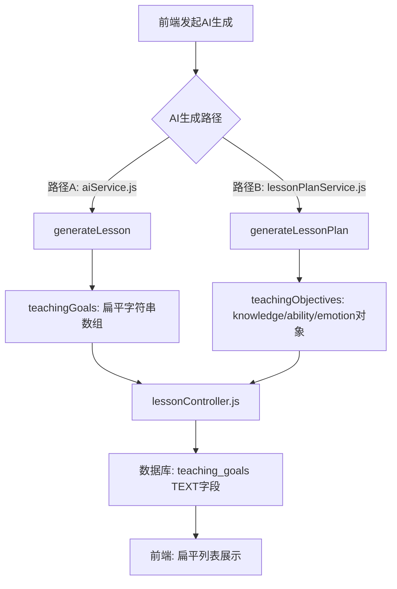
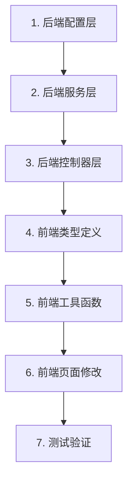

# 教学目标从三维目标改为新课标核心素养维度 — 完整修改方案

## 一、现状分析

### 1.1 当前数据流



### 1.2 当前教学目标格式

**路径A** (`aiService.js` 第659行 `generateLesson`):
```json
[
  "知识与技能：理解XX的基本概念",
  "过程与方法：通过观察、实验培养探究能力",
  "情感态度与价值观：激发学习兴趣"
]
```

**路径B** (`lessonPlanService.js` 第9行 `LESSON_PLAN_PROMPT_TEMPLATE`):
```json
{
  "knowledge": ["知识目标列表"],
  "ability": ["过程与方法目标列表"],
  "emotion": ["情感态度目标列表"]
}
```

### 1.3 涉及修改的文件清单

| 文件 | 修改类型 | 说明 |
|------|---------|------|
| `backend/src/config/subjectsConfig.js` | 新增字段 | 每个学科新增 `dimensionConfig` |
| `backend/src/config/curriculumStandards.js` | 修改 | 教学目标评估标准改为动态维度 |
| `backend/src/services/lessonPlanService.js` | 修改 | 提示词模板和生成函数 |
| `backend/src/services/aiService.js` | 修改 | `generateLesson()` 和 `getMockLesson()` |
| `backend/src/controllers/lessonController.js` | 新增 | 数据格式转换函数 |
| `frontend/src/types/index.ts` | 新增 | 新的教学目标类型定义 |
| `frontend/src/pages/Lessons/Create.tsx` | 修改 | 教学目标编辑和展示 |
| `frontend/src/pages/Lessons/Detail.tsx` | 修改 | 教学目标详情展示 |
| `frontend/src/pages/Lessons/Generate.tsx` | 修改 | AI生成结果展示 |
| `frontend/src/pages/Lessons/SyncEdit.tsx` | 修改 | 同步编辑页面 |

---

## 二、数据结构设计

### 2.1 新的教学目标 JSON 结构

```json
{
  "version": 2,
  "dimensions": [
    {
      "id": "language_construction",
      "name": "语言建构与运用",
      "description": "积累语言材料，感受语言文字的特点",
      "goals": [
        "能够正确、流利、有感情地朗读课文",
        "积累本课优美的词句和段落"
      ]
    },
    {
      "id": "thinking_development",
      "name": "思维发展与提升",
      "description": "通过语言运用，发展形象思维和逻辑思维",
      "goals": [
        "通过分析课文结构，发展逻辑思维能力"
      ]
    },
    {
      "id": "aesthetic_appreciation",
      "name": "审美鉴赏与创造",
      "description": "感受语言文字之美，培养审美意识",
      "goals": [
        "感受课文语言的优美，体会作者的情感表达"
      ]
    },
    {
      "id": "cultural_inheritance",
      "name": "文化传承与理解",
      "description": "热爱中华文化，继承优秀传统文化",
      "goals": [
        "了解课文涉及的传统文化知识"
      ]
    }
  ]
}
```

### 2.2 版本标识设计

- `version: 2` — 新课标核心素养维度格式
- 无 `version` 字段或 `version: 1` — 旧版三维目标格式

### 2.3 各学科核心素养维度配置

基于新课标文件分析，各学科的核心素养维度如下：

#### 语文
| 维度ID | 维度名称 | 说明 |
|--------|---------|------|
| `language_construction` | 语言建构与运用 | 积累语言材料，感受语言文字的特点 |
| `thinking_development` | 思维发展与提升 | 通过语言运用，发展形象思维和逻辑思维 |
| `aesthetic_appreciation` | 审美鉴赏与创造 | 感受语言文字之美，培养审美意识 |
| `cultural_inheritance` | 文化传承与理解 | 热爱中华文化，继承优秀传统文化 |

#### 数学
| 维度ID | 维度名称 | 说明 |
|--------|---------|------|
| `number_sense` | 数感 | 理解数的意义，建立数感 |
| `quantity_sense` | 量感 | 感受物体的多少、大小 |
| `symbol_awareness` | 符号意识 | 理解符号表示数量关系 |
| `operation_ability` | 运算能力 | 能够准确进行计算 |
| `geometric_intuition` | 几何直观 | 利用图形描述和分析问题 |
| `reasoning_ability` | 推理能力 | 发展合情推理和演绎推理能力 |
| `model_awareness` | 模型意识 | 感悟数学模型的价值 |
| `data_analysis` | 数据意识 | 感受数据的意义和作用 |

#### 英语
| 维度ID | 维度名称 | 说明 |
|--------|---------|------|
| `language_ability` | 语言能力 | 理解语言含义，能进行简单交流 |
| `cultural_awareness` | 文化意识 | 了解中西方文化差异 |
| `thinking_quality` | 思维品质 | 发展英语思维能力 |
| `learning_ability` | 学习能力 | 掌握英语学习方法 |

#### 道德与法治
| 维度ID | 维度名称 | 说明 |
|--------|---------|------|
| `political_identity` | 政治认同 | 认同中国特色社会主义 |
| `moral_cultivation` | 道德修养 | 提升道德品质 |
| `legal_awareness` | 法治观念 | 树立法治意识 |
| `healthy_personality` | 健全人格 | 培养健全人格 |
| `responsibility` | 责任意识 | 增强社会责任感 |

#### 科学
| 维度ID | 维度名称 | 说明 |
|--------|---------|------|
| `scientific_concept` | 科学观念 | 理解基本的科学概念 |
| `scientific_thinking` | 科学思维 | 发展探究能力和创新思维 |
| `inquiry_practice` | 探究实践 | 掌握基本的科学探究方法 |
| `social_responsibility` | 社会责任 | 了解科学技术与社会的关系 |

#### 物理
| 维度ID | 维度名称 | 说明 |
|--------|---------|------|
| `physics_concept` | 物理观念 | 形成物质观念、运动观念等 |
| `scientific_thinking` | 科学思维 | 建模、科学推理、科学论证 |
| `experimental_inquiry` | 实验探究 | 问题、证据、解释、交流 |
| `scientific_attitude` | 科学态度与责任 | 探索自然的内在动力 |

#### 化学
| 维度ID | 维度名称 | 说明 |
|--------|---------|------|
| `macro_recognition` | 宏观辨识与微观探析 | 从不同尺度认识物质 |
| `change_concept` | 变化观念与平衡思想 | 认识物质变化的规律 |
| `evidence_reasoning` | 证据推理与模型认知 | 基于证据进行推理 |
| `experiment_inquiry` | 科学探究与创新意识 | 发现和提出有价值的问题 |
| `scientific_attitude` | 科学态度与社会责任 | 严谨求实的科学态度 |

#### 生物学
| 维度ID | 维度名称 | 说明 |
|--------|---------|------|
| `life_concept` | 生命观念 | 结构与功能、进化与适应等 |
| `scientific_thinking` | 科学思维 | 归纳概括、演绎推理等 |
| `inquiry_practice` | 探究实践 | 观察、提问、设计实验等 |
| `social_responsibility` | 社会责任 | 健康生活、环境保护等 |

#### 历史
| 维度ID | 维度名称 | 说明 |
|--------|---------|------|
| `historical_materialism` | 唯物史观 | 揭示人类社会发展的客观规律 |
| `spatiotemporal_concept` | 时空观念 | 在特定时间和空间中观察事物 |
| `historical_evidence` | 史料实证 | 通过史料认识历史 |
| `historical_explanation` | 历史解释 | 对历史事物进行理性分析 |
| `patriotic_feeling` | 家国情怀 | 形成对国家和民族的认同 |

#### 地理
| 维度ID | 维度名称 | 说明 |
|--------|---------|------|
| `human_earth_coordination` | 人地协调观 | 正确认识人类活动与地理环境的关系 |
| `comprehensive_thinking` | 综合思维 | 从多个维度认识地理事物 |
| `regional_cognition` | 区域认知 | 从区域视角认识地理环境 |
| `geographic_practice` | 地理实践力 | 在实践中获取和运用地理知识 |

#### 信息科技/信息技术
| 维度ID | 维度名称 | 说明 |
|--------|---------|------|
| `information_awareness` | 信息意识 | 认识到信息的重要性 |
| `computational_thinking` | 计算思维 | 用计算机方式思考问题 |
| `digital_learning` | 数字化学习与创新 | 利用数字化工具学习 |
| `information_responsibility` | 信息社会责任 | 安全、负责任地使用信息 |

#### 音乐
| 维度ID | 维度名称 | 说明 |
|--------|---------|------|
| `aesthetic_perception` | 审美感知 | 感受音乐之美 |
| `artistic_expression` | 艺术表现 | 能够表现音乐 |
| `creative_practice` | 创意实践 | 能够创作音乐 |
| `cultural_understanding` | 文化理解 | 理解音乐的文化内涵 |

#### 美术
| 维度ID | 维度名称 | 说明 |
|--------|---------|------|
| `aesthetic_perception` | 审美感知 | 感受美的事物 |
| `artistic_expression` | 艺术表现 | 通过创作表达想法 |
| `creative_practice` | 创意实践 | 创造性地解决问题 |
| `cultural_understanding` | 文化理解 | 理解美术与文化的关系 |

#### 体育与健康
| 维度ID | 维度名称 | 说明 |
|--------|---------|------|
| `motor_skills` | 运动能力 | 掌握基本运动技能 |
| `health_behavior` | 健康行为 | 养成健康的生活方式 |
| `sports_morality` | 体育品德 | 培养团队合作精神 |

#### 劳动
| 维度ID | 维度名称 | 说明 |
|--------|---------|------|
| `labor_concept` | 劳动观念 | 认识劳动的价值 |
| `labor_ability` | 劳动能力 | 掌握基本劳动技能 |
| `labor_habits` | 劳动习惯与品质 | 养成良好的劳动习惯 |
| `labor_spirit` | 劳动精神 | 崇尚劳动、尊重劳动 |

---

## 三、后端修改方案

### 3.1 subjectsConfig.js 修改

在每个学科配置中新增 `dimensionConfig` 字段，与现有 `coreQualities` 和 `teachingObjectives` 保持关联。

**修改位置**: `backend/src/config/subjectsConfig.js`

**修改内容**: 在每个学科对象中新增 `dimensionConfig` 字段。

以语文为例：
```javascript
'语文': {
  category: '核心学科',
  keywords: ['阅读', '写作', '口语交际', '识字写字', '古诗词', '阅读理解', '作文'],
  // 保留现有字段不变
  coreQualities: [
    '语言建构与运用：积累语言材料，感受语言文字的特点',
    // ...
  ],
  teachingObjectives: {
    knowledge: [/* 保留 */],
    ability: [/* 保留 */],
    emotion: [/* 保留 */]
  },
  // ===== 新增字段 =====
  dimensionConfig: {
    dimensions: [
      {
        id: 'language_construction',
        name: '语言建构与运用',
        description: '积累语言材料，感受语言文字的特点，丰富语言经验，培养语感',
        objectiveTemplates: [
          '能够正确、流利、有感情地朗读课文',
          '积累本课优美的词句和段落',
          '能够用自己的语言表达对课文的理解'
        ]
      },
      {
        id: 'thinking_development',
        name: '思维发展与提升',
        description: '通过语言运用，发展形象思维、逻辑思维和辩证思维',
        objectiveTemplates: [
          '通过分析课文结构，发展逻辑思维能力',
          '能够对课文内容进行分析、比较和归纳'
        ]
      },
      {
        id: 'aesthetic_appreciation',
        name: '审美鉴赏与创造',
        description: '感受语言文字之美，培养审美意识和审美创造能力',
        objectiveTemplates: [
          '感受课文语言的优美，体会作者的情感表达',
          '能够欣赏文学作品的艺术魅力'
        ]
      },
      {
        id: 'cultural_inheritance',
        name: '文化传承与理解',
        description: '热爱中华文化，继承优秀传统文化，增强文化自信',
        objectiveTemplates: [
          '了解课文涉及的传统文化知识',
          '增强对中华优秀传统文化的认同感'
        ]
      }
    ],
    minDimensions: 2,  // 至少覆盖几个维度
    goalsPerDimension: [1, 3]  // 每个维度的目标数量范围
  },
  // 保留其他字段...
  teachingProcess: { /* 保留 */ },
  assessment: [/* 保留 */]
}
```

**注意**: 所有学科都需要添加 `dimensionConfig` 字段。对于未在上面列出的学科（如综合实践活动、心理健康等），可以使用通用维度配置。

### 3.2 新增通用维度配置

在 `subjectsConfig.js` 中新增一个通用维度配置导出：

```javascript
// 通用核心素养维度（用于未配置特定维度的学科）
const defaultDimensionConfig = {
  dimensions: [
    {
      id: 'knowledge_understanding',
      name: '知识理解',
      description: '理解本学科的基本概念、原理和方法',
      objectiveTemplates: ['理解本课涉及的基本概念', '掌握核心知识点']
    },
    {
      id: 'ability_development',
      name: '能力发展',
      description: '发展本学科相关的核心能力',
      objectiveTemplates: ['能够运用所学知识解决问题', '培养分析和实践能力']
    },
    {
      id: 'quality_cultivation',
      name: '素养培育',
      description: '培养学科素养和综合品质',
      objectiveTemplates: ['培养学习兴趣和探究精神', '形成正确的价值观和态度']
    }
  ],
  minDimensions: 2,
  goalsPerDimension: [1, 3]
};
```

### 3.3 新增辅助函数

在 `subjectsConfig.js` 中新增：

```javascript
/**
 * 获取学科的核心素养维度配置
 * @param {string} subject 学科名称
 * @param {string} stage 学段 (primary/middle/high)
 * @returns {Object} 维度配置
 */
const getDimensionConfig = (subject, stage) => {
  const config = getSubjectConfig(subject, stage);
  if (config && config.dimensionConfig) {
    return config.dimensionConfig;
  }
  return defaultDimensionConfig;
};

module.exports = {
  subjectsConfig,
  getSubjectConfig,
  getStageByGrade,
  getDimensionConfig,
  defaultDimensionConfig
};
```

### 3.4 curriculumStandards.js 修改

**修改位置**: `backend/src/config/curriculumStandards.js`

**修改内容**: 将 `teachingObjectives` 评估维度从固定三维改为动态评估。

```javascript
// 修改前（第8-41行）：
teachingObjectives: {
  name: '教学目标',
  weight: 25,
  subDimensions: {
    knowledge: { name: '知识与技能', weight: 10, criteria: [...] },
    process: { name: '过程与方法', weight: 8, criteria: [...] },
    emotion: { name: '情感态度', weight: 7, criteria: [...] }
  }
}

// 修改后：
teachingObjectives: {
  name: '教学目标',
  weight: 25,
  // 保留旧的subDimensions用于向后兼容
  subDimensions: {
    knowledge: { name: '知识与技能', weight: 10, criteria: [...] },
    process: { name: '过程与方法', weight: 8, criteria: [...] },
    emotion: { name: '情感态度', weight: 7, criteria: [...] }
  },
  // 新增：按核心素养维度的评估标准
  competencyCriteria: [
    { keyword: '核心素养', score: 3, description: '教学目标体现学科核心素养要求' },
    { keyword: '维度覆盖', score: 3, description: '目标覆盖多个核心素养维度' },
    { keyword: '具体可测', score: 3, description: '目标具体、可观察、可测量' },
    { keyword: '层次分明', score: 3, description: '目标体现层次性和递进性' },
    { keyword: '学科特色', score: 3, description: '体现本学科独特的素养要求' }
  ],
  // 新增：各学科核心素养关键词（用于评估）
  subjectKeywords: {
    语文: ['语言建构', '思维发展', '审美鉴赏', '文化传承'],
    数学: ['数感', '量感', '符号意识', '运算能力', '几何直观', '推理能力', '模型意识', '数据意识'],
    英语: ['语言能力', '文化意识', '思维品质', '学习能力'],
    // ... 其他学科
  }
}
```

同时更新 `suggestions` 部分：

```javascript
suggestions: {
  teachingObjectives: [
    '教学目标应基于学科核心素养维度设计',
    '每个核心素养维度下设置1-3个具体教学目标',
    '目标描述应具体、可观测、可评价',
    '建议使用行为动词描述目标（如：说出、列出、解释等）',
    '目标应基于课程标准和学生实际制定',
    '注意各维度之间的内在联系和整合'
  ],
  // ... 其他建议保持不变
}
```

### 3.5 lessonPlanService.js 修改

**修改位置**: `backend/src/services/lessonPlanService.js`

#### 3.5.1 修改 `LESSON_PLAN_PROMPT_TEMPLATE`（第9-74行）

将教学目标 JSON 结构改为动态维度：

```javascript
const LESSON_PLAN_PROMPT_TEMPLATE = `你是一位经验丰富的教育专家，精通各学科教学。请根据提供的信息，生成一份详细的教案。

## 基本要求
1. 教案输出格式为JSON
2. 教案内容要符合新课程标准要求
3. 要体现学科核心素养
4. 教学过程要生动有趣，注重师生互动

## 教案JSON结构
{
  "basicInfo": {
    "title": "教案标题",
    "subject": "学科",
    "grade": "年级",
    "teachingType": "授课类型",
    "duration": "课时时长"
  },
  "teachingObjectives": {
    "version": 2,
    "dimensions": [
      {
        "id": "核心素养维度ID",
        "name": "核心素养维度名称",
        "goals": [
          "该维度下的具体教学目标1",
          "该维度下的具体教学目标2"
        ]
      }
    ]
  },
  "teachingKeyPoints": {
    "key": ["教学重点"],
    "difficult": ["教学难点"]
  },
  "teachingPreparation": ["教学准备"],
  "teachingProcess": {
    "introduction": {
      "duration": "导入时长",
      "activities": ["导入环节的具体活动"]
    },
    "newTeaching": {
      "duration": "新授时长",
      "stages": [
        {
          "stageName": "环节名称",
          "duration": "环节时长",
          "teacherActivities": ["教师活动"],
          "studentActivities": ["学生活动"],
          "teachingPoints": ["教学要点"],
          "timeAllocation": "时间分配"
        }
      ]
    },
    "practice": {
      "duration": "练习时长",
      "activities": ["练习活动的具体内容"]
    },
    "summary": {
      "duration": "总结时长",
      "activities": ["总结环节的活动"]
    }
  },
  "teachingReflection": {
    "expectedHighlights": ["预期教学亮点"],
    "possibleProblems": ["可能出现的问题"],
    "suggestions": ["教学建议"]
  },
  "homework": ["作业内容"]
}

## 教学目标重要说明
- teachingObjectives必须包含version字段，值为2
- dimensions数组中每个元素代表一个核心素养维度
- 每个维度包含id、name和goals数组
- goals数组中每个元素是一个具体的教学目标描述
- 至少覆盖2-3个核心素养维度
- 每个维度下设置1-3个具体目标
- 目标描述要具体、可操作、可评价

## 输出要求
1. 只输出JSON格式的教案，不要包含其他解释性文字
2. JSON必须符合上述结构
3. 确保教案内容专业、准确、可操作`;
```

#### 3.5.2 修改 `generateSubjectAwarePrompt()`（第76-192行）

将教学目标参考部分从三维改为按维度生成：

```javascript
const generateSubjectAwarePrompt = (topic, grade, subject, additionalRequirements = {}) => {
  // ... 学段检测逻辑保持不变（第77-132行）...

  // 获取维度配置
  const dimensionConfig = subjectConfig.dimensionConfig || defaultDimensionConfig;

  let prompt = `请为${subject}学科设计一份教案。

## 学科信息
- 学科：${subject}
- 学段：${stage === 'primary' ? '小学' : stage === 'middle' ? '初中' : '高中'}
- 年级：${grade}
- 教学主题：${topic}

## 学科核心素养要求
${dimensionConfig.dimensions.map(d => `### ${d.name}\n${d.description}\n参考目标模板：\n${d.objectiveTemplates.map(t => `- ${t}`).join('\n')}`).join('\n\n')}

## 本学科教学特点
- 类别：${subjectConfig.category}
- 关键词：${subjectConfig.keywords.join('、')}

## 教学目标设计要求
请基于以上核心素养维度设计教学目标，要求：
1. 至少覆盖${dimensionConfig.minDimensions}个核心素养维度
2. 每个维度下设置${dimensionConfig.goalsPerDimension[0]}-${dimensionConfig.goalsPerDimension[1]}个具体目标
3. 目标描述要具体、可操作、可评价
4. 注意各维度之间的内在联系

## 教学过程参考
### 导入环节
${subjectConfig.teachingProcess.introduction.map((t, i) => `${i + 1}. ${t}`).join('\n')}

### 新课讲授
${subjectConfig.teachingProcess.newTeaching.map((t, i) => `${i + 1}. ${t}`).join('\n')}

### 练习环节
${subjectConfig.teachingProcess.practice.map((p, i) => `${i + 1}. ${p}`).join('\n')}

### 总结环节
${subjectConfig.teachingProcess.summary.map((s, i) => `${i + 1}. ${s}`).join('\n')}

## 评价方式
${subjectConfig.assessment.map((a, i) => `${i + 1}. ${a}`).join('\n')}`;

  // ... 其余附加参数处理保持不变 ...

  return prompt;
};
```

### 3.6 aiService.js 修改

**修改位置**: `backend/src/services/aiService.js`

#### 3.6.1 修改 `generateLesson()` 的 systemPrompt（第666-687行）

```javascript
// 修改前：
const systemPrompt = `你是一位资深的教育专家...
1. 教学目标（至少5-8个，详细阐述知识与技能、过程与方法、情感态度价值观三维目标）
...
- teachingGoals: 教学目标数组（每个目标都要详细描述，至少100字）
`;

// 修改后：
const systemPrompt = `你是一位资深的教育专家，拥有30年一线教学经验，擅长设计高质量、详细完整的课程计划。

请根据提供的信息，生成一份极其详细、完整、丰富的教案。教案要像一篇完整的教学设计文档，内容要详尽、深入、有血有肉。

【教案要求】
1. 教学目标（基于学科核心素养维度设计，每个维度1-3个具体目标，至少覆盖2-3个维度）
2. 教学重难点（至少3-5个，要具体说明重点和难点）
3. 教学过程（极其详细，每个环节都要有具体内容、时间分配、教师活动、学生活动、设计意图）
4. 作业布置：设计分层作业，照顾不同层次学生
5. 教学反思：提供教学建议和注意事项

【格式要求】
请用JSON格式返回，包含以下字段：
- teachingGoals: 教学目标对象，格式为 { version: 2, dimensions: [{ id: "维度ID", name: "维度名称", goals: ["目标1", "目标2"] }] }
- keyPoints: 教学重难点数组
- teachingProcess: 教学过程对象
- assignments: 课后作业
- summary: 教学总结

【重要说明】
- teachingGoals必须是对象格式，包含version和dimensions字段
- dimensions数组中每个元素代表一个核心素养维度
- 每个维度包含id、name和goals数组
- 至少覆盖2-3个核心素养维度
- 每个维度下设置1-3个具体目标`;
```

#### 3.6.2 修改 `getMockLesson()`（第1265-1289行）

```javascript
static getMockLesson(subject, grade, topic) {
    // 获取学科的维度配置
    const { getDimensionConfig, getStageByGrade: getStage } = require('../config/subjectsConfig');
    const stage = getStage(grade);
    const dimConfig = getDimensionConfig(subject, stage || 'middle');

    // 基于维度配置生成模拟教学目标
    const dimensions = dimConfig.dimensions.slice(0, 3).map(dim => ({
      id: dim.id,
      name: dim.name,
      goals: [
        `理解${topic}相关的${dim.name}核心要求`,
        `能够运用${topic}知识体现${dim.name}素养`
      ]
    }));

    return {
        teachingGoals: {
            version: 2,
            dimensions
        },
        keyPoints: [
            `重点：${topic}的定义、性质和基本应用`,
            `重点：${topic}与相关知识的联系与区别`,
            `难点：${topic}的深层原理和复杂应用`,
            `难点：如何引导学生理解${topic}的抽象概念`
        ],
        // teachingProcess, assignments, summary 保持不变
        teachingProcess: {
            introduction: `【导入环节】[5分钟]...`,
            mainContent: `【新课讲授】[25分钟]...`,
            practice: `【巩固练习】[10分钟]...`,
            summary: `【课堂小结】[5分钟]...`
        },
        assignments: `【课后作业】...`,
        summary: `【教学反思】...`
    };
}
```

#### 3.6.3 修改 `parseLessonFromText()` 中的目标解析

需要添加对新格式的解析支持。在 `aiService.js` 中搜索 `parseLessonFromText` 函数，确保它能正确处理新的维度结构。

### 3.7 lessonController.js 新增数据转换函数

**修改位置**: `backend/src/controllers/lessonController.js`

在文件顶部新增数据转换工具函数：

```javascript
/**
 * 格式化教学目标数据用于存储
 * 支持新旧两种格式输入，统一存储为新格式
 */
const formatTeachingGoalsForStorage = (teachingGoals) => {
  if (!teachingGoals) return null;

  // 如果已经是新格式（对象且有dimensions字段）
  if (typeof teachingGoals === 'object' && !Array.isArray(teachingGoals) && teachingGoals.dimensions) {
    return JSON.stringify(teachingGoals);
  }

  // 如果是旧格式（数组）
  if (typeof teachingGoals === 'string') {
    try {
      const parsed = JSON.parse(teachingGoals);
      if (Array.isArray(parsed)) {
        // 旧格式扁平数组，尝试转换
        return JSON.stringify(convertLegacyGoals(parsed));
      }
      // 已经是对象格式
      if (parsed.dimensions) {
        return JSON.stringify(parsed);
      }
      // 旧格式 knowledge/ability/emotion
      if (parsed.knowledge || parsed.ability || parsed.emotion) {
        return JSON.stringify(convertLegacyObjectGoals(parsed));
      }
    } catch {
      // 不是JSON，作为纯文本处理
      return JSON.stringify({
        version: 2,
        dimensions: [{
          id: 'general',
          name: '教学目标',
          goals: teachingGoals.split('\n').filter(l => l.trim())
        }]
      });
    }
  }

  if (Array.isArray(teachingGoals)) {
    return JSON.stringify(convertLegacyGoals(teachingGoals));
  }

  return JSON.stringify(teachingGoals);
};

/**
 * 将旧版扁平数组格式转换为新格式
 */
const convertLegacyGoals = (goalsArray) => {
  if (!goalsArray || goalsArray.length === 0) {
    return { version: 2, dimensions: [] };
  }

  const dimensionMap = {};
  const generalGoals = [];

  goalsArray.forEach(goal => {
    const str = typeof goal === 'string' ? goal : String(goal);
    // 尝试匹配 "维度名：目标内容" 格式
    const match = str.match(/^([^：:]+)[：:](.+)/);
    if (match) {
      const dimName = match[1].trim();
      const goalContent = match[2].trim();
      if (!dimensionMap[dimName]) {
        dimensionMap[dimName] = [];
      }
      dimensionMap[dimName].push(goalContent);
    } else {
      generalGoals.push(str);
    }
  });

  const dimensions = [];
  for (const [name, goals] of Object.entries(dimensionMap)) {
    dimensions.push({
      id: name.replace(/[^a-zA-Z\u4e00-\u9fa5]/g, '_'),
      name,
      goals
    });
  }

  if (generalGoals.length > 0 && dimensions.length === 0) {
    dimensions.push({
      id: 'general',
      name: '教学目标',
      goals: generalGoals
    });
  } else if (generalGoals.length > 0) {
    dimensions.push({
      id: 'general',
      name: '综合目标',
      goals: generalGoals
    });
  }

  return { version: 2, dimensions };
};

/**
 * 将旧版 knowledge/ability/emotion 对象格式转换为新格式
 */
const convertLegacyObjectGoals = (obj) => {
  const dimensions = [];
  const mapping = {
    knowledge: { id: 'knowledge', name: '知识与技能' },
    ability: { id: 'ability', name: '过程与方法' },
    emotion: { id: 'emotion', name: '情感态度与价值观' }
  };

  for (const [key, config] of Object.entries(mapping)) {
    if (obj[key] && Array.isArray(obj[key]) && obj[key].length > 0) {
      dimensions.push({
        id: config.id,
        name: config.name,
        goals: obj[key]
      });
    }
  }

  return { version: 2, dimensions };
};

/**
 * 格式化教学目标数据用于前端展示
 * 确保返回的数据格式统一
 */
const formatTeachingGoalsForDisplay = (teachingGoals) => {
  if (!teachingGoals) return { version: 2, dimensions: [] };

  // 如果是字符串，先解析
  let data = teachingGoals;
  if (typeof data === 'string') {
    try {
      data = JSON.parse(data);
    } catch {
      return {
        version: 2,
        dimensions: [{
          id: 'general',
          name: '教学目标',
          goals: data.split('\n').filter(l => l.trim())
        }]
      };
    }
  }

  // 新格式
  if (data && typeof data === 'object' && data.dimensions) {
    return data;
  }

  // 旧格式数组
  if (Array.isArray(data)) {
    return convertLegacyGoals(data);
  }

  // 旧格式对象
  if (data && typeof data === 'object' && (data.knowledge || data.ability || data.emotion)) {
    return convertLegacyObjectGoals(data);
  }

  return { version: 2, dimensions: [] };
};
```

在 `generateByAI` 函数中（第378行），修改数据保存逻辑：

```javascript
// 修改前（第413行）：
const teachingGoals = JSON.stringify(aiResult.teachingGoals || []);

// 修改后：
const teachingGoals = formatTeachingGoalsForStorage(aiResult.teachingGoals);
```

在 `createLesson` 和 `updateLesson` 函数中也需要调用 `formatTeachingGoalsForStorage`。

在 `getLessonDetail` 返回数据时，需要格式化：

```javascript
// 在返回数据前添加：
const lessonData = {
  ...lesson,
  teachingGoals: formatTeachingGoalsForDisplay(lesson.teachingGoals)
};
```

---

## 四、前端修改方案

### 4.1 类型定义修改

**修改位置**: `frontend/src/types/index.ts`

```typescript
// 新增核心素养维度教学目标类型
export interface CoreCompetencyDimension {
  id: string;
  name: string;
  description?: string;
  goals: string[];
}

export interface TeachingGoalsData {
  version: number;
  dimensions: CoreCompetencyDimension[];
}

// 修改 Lesson 接口中的 teachingGoals 类型
export interface Lesson {
  id: number;
  userId: number;
  title: string;
  subject: string;
  grade: string;
  teachingGoals: TeachingGoalsData | string | string[];  // 支持新旧格式
  keyPoints: string | string[];
  teachingProcess: string | Record<string, unknown>;
  assignments?: string;
  summary?: string;
  status: 'draft' | 'published';
  views: number;
  createdAt: string;
  updatedAt: string;
}

// 新增：学科维度配置类型
export interface DimensionConfig {
  id: string;
  name: string;
  description: string;
  objectiveTemplates: string[];
}

export interface SubjectDimensionConfig {
  dimensions: DimensionConfig[];
  minDimensions: number;
  goalsPerDimension: [number, number];
}
```

### 4.2 新增教学目标工具函数

在 `frontend/src/utils/` 目录下新增 `teachingGoalsHelper.ts`：

```typescript
import type { TeachingGoalsData, CoreCompetencyDimension } from '@/types';

/**
 * 判断教学目标数据是否为新格式
 */
export const isNewFormat = (data: any): data is TeachingGoalsData => {
  return data && typeof data === 'object' && !Array.isArray(data) && Array.isArray(data.dimensions);
};

/**
 * 解析教学目标数据，统一为新格式
 */
export const parseTeachingGoals = (data: any): TeachingGoalsData => {
  if (!data) return { version: 2, dimensions: [] };

  // 新格式
  if (isNewFormat(data)) return data;

  // 字符串
  if (typeof data === 'string') {
    try {
      const parsed = JSON.parse(data);
      return parseTeachingGoals(parsed);
    } catch {
      return {
        version: 2,
        dimensions: [{
          id: 'general',
          name: '教学目标',
          goals: data.split('\n').filter((l: string) => l.trim())
        }]
      };
    }
  }

  // 旧格式数组
  if (Array.isArray(data)) {
    return convertLegacyArray(data);
  }

  // 旧格式对象 knowledge/ability/emotion
  if (data.knowledge || data.ability || data.emotion) {
    return convertLegacyObject(data);
  }

  return { version: 2, dimensions: [] };
};

// ... 转换函数与后端逻辑一致
```

### 4.3 Create.tsx 修改

**修改位置**: `frontend/src/pages/Lessons/Create.tsx`

#### 4.3.1 修改教学目标展示区域（约第1170-1195行）

将原来的单一 textarea 改为按维度分组展示：

```tsx
{/* 教学目标与重难点卡片 */}
<div className="bg-white rounded-2xl shadow-sm border border-gray-100 p-6 mb-5">
  <div className="flex items-center justify-between mb-4">
    <div>
      <h3 className="font-semibold text-gray-800">教学目标与重难点</h3>
      <p className="text-xs text-gray-400">基于学科核心素养维度设计</p>
    </div>
  </div>

  {/* 核心素养维度分组展示 */}
  <div className="space-y-4">
    {parsedDimensions.map((dim, dimIndex) => (
      <div key={dim.id} className="border border-gray-200 rounded-lg p-4">
        <div className="flex items-center gap-2 mb-3">
          <span className="inline-flex items-center px-2.5 py-0.5 rounded-full text-xs font-medium bg-primary-100 text-primary-700">
            {dim.name}
          </span>
          {dim.description && (
            <span className="text-xs text-gray-400">{dim.description}</span>
          )}
        </div>
        <div className="space-y-2">
          {dim.goals.map((goal, goalIndex) => (
            <div key={goalIndex} className="flex items-start gap-2">
              <span className="flex-shrink-0 w-5 h-5 rounded-full bg-primary-50 text-primary-600 flex items-center justify-center text-xs font-medium mt-0.5">
                {goalIndex + 1}
              </span>
              <textarea
                value={goal}
                onChange={(e) => handleGoalChange(dimIndex, goalIndex, e.target.value)}
                className="flex-1 text-sm text-gray-600 border-0 bg-transparent focus:outline-none focus:ring-1 focus:ring-primary-300 rounded p-1 resize-none"
                rows={1}
                placeholder="输入教学目标"
              />
              <button
                onClick={() => handleRemoveGoal(dimIndex, goalIndex)}
                className="text-gray-400 hover:text-red-500"
              >
                ×
              </button>
            </div>
          ))}
          <button
            onClick={() => handleAddGoal(dimIndex)}
            className="text-xs text-primary-500 hover:text-primary-700 flex items-center gap-1"
          >
            + 添加目标
          </button>
        </div>
      </div>
    ))}

    {/* 添加维度按钮 */}
    <button
      onClick={handleAddDimension}
      className="w-full py-2 border-2 border-dashed border-gray-300 rounded-lg text-sm text-gray-500 hover:border-primary-400 hover:text-primary-500 transition-colors"
    >
      + 添加核心素养维度
    </button>
  </div>
</div>
```

#### 4.3.2 修改 AI 生成结果解析（约第584-624行）

```typescript
// 修改前：
let teachingGoals: string[] = [];
if (result.teachingObjectives) {
  const obj = result.teachingObjectives;
  if (typeof obj === 'object' && obj !== null) {
    teachingGoals = [
      ...(Array.isArray(obj.knowledge) ? obj.knowledge : []),
      ...(Array.isArray(obj.ability) ? obj.ability : []),
      ...(Array.isArray(obj.emotion) ? obj.emotion : [])
    ];
  }
}

// 修改后：
let teachingGoals: TeachingGoalsData;
if (result.teachingGoals) {
  // 路径A：已经是新格式或旧格式
  if (typeof result.teachingGoals === 'object' && !Array.isArray(result.teachingGoals) && result.teachingGoals.dimensions) {
    teachingGoals = result.teachingGoals;
  } else {
    teachingGoals = parseTeachingGoals(result.teachingGoals);
  }
} else if (result.teachingObjectives) {
  // 路径B：旧格式 teachingObjectives
  const obj = result.teachingObjectives;
  if (typeof obj === 'object' && obj !== null) {
    teachingGoals = parseTeachingGoals(obj);
  } else {
    teachingGoals = { version: 2, dimensions: [] };
  }
} else {
  teachingGoals = { version: 2, dimensions: [] };
}
```

### 4.4 Detail.tsx 修改

**修改位置**: `frontend/src/pages/Lessons/Detail.tsx`

修改教学目标展示区域（约第405-424行），按维度分组展示：

```tsx
{lesson.teachingGoals && (
  <div className="p-6 border-b border-gray-100">
    <h2 className="text-lg font-semibold text-gray-800 mb-4 flex items-center">
      <svg className="h-5 w-5 mr-2 text-primary-500" fill="none" stroke="currentColor" viewBox="0 0 24 24">
        <path strokeLinecap="round" strokeLinejoin="round" strokeWidth={2} d="M9 12l2 2 4-4m6 2a9 9 0 11-18 0 9 9 0 0118 0z" />
      </svg>
      教学目标
    </h2>
    {renderTeachingGoals(lesson.teachingGoals)}
  </div>
)}
```

新增 `renderTeachingGoals` 函数：

```tsx
const renderTeachingGoals = (goals: any): React.ReactNode => {
  const data = parseTeachingGoals(goals);

  if (!data.dimensions || data.dimensions.length === 0) {
    return <p className="text-gray-500">暂无教学目标</p>;
  }

  return (
    <div className="space-y-4">
      {data.dimensions.map((dim, dimIndex) => (
        <div key={dim.id || dimIndex} className="border-l-4 border-primary-300 pl-4">
          <h3 className="text-sm font-semibold text-primary-700 mb-2">{dim.name}</h3>
          <ul className="space-y-1.5">
            {dim.goals.map((goal, goalIndex) => (
              <li key={goalIndex} className="flex items-start gap-2">
                <span className="flex-shrink-0 w-5 h-5 rounded-full bg-primary-100 text-primary-600 flex items-center justify-center text-xs font-medium">
                  {goalIndex + 1}
                </span>
                <span className="text-sm text-gray-600">{goal}</span>
              </li>
            ))}
          </ul>
        </div>
      ))}
    </div>
  );
};
```

### 4.5 Generate.tsx 修改

**修改位置**: `frontend/src/pages/Lessons/Generate.tsx`

修改 `generatedLesson` 的类型定义（约第21-31行）和教学目标展示：

```typescript
// 修改前：
const [generatedLesson, setGeneratedLesson] = useState<{
  id?: number;
  title: string;
  subject: string;
  grade: string;
  teachingGoals: string[];
  keyPoints: string[];
  teachingProcess: Record<string, unknown> | string;
  assignments: string;
  summary: string;
} | null>(null);

// 修改后：
const [generatedLesson, setGeneratedLesson] = useState<{
  id?: number;
  title: string;
  subject: string;
  grade: string;
  teachingGoals: TeachingGoalsData;
  keyPoints: string[];
  teachingProcess: Record<string, unknown> | string;
  assignments: string;
  summary: string;
} | null>(null);
```

在结果展示区域（约第1033-1038行）按维度分组展示：

```tsx
{generatedLesson.teachingGoals.dimensions?.length > 0
  ? generatedLesson.teachingGoals.dimensions.map((dim, dimIndex) => (
      <div key={dim.id || dimIndex} className="mb-3">
        <div className="font-medium text-primary-700 mb-1">【{dim.name}】</div>
        {dim.goals.map((goal, goalIndex) => (
          <div key={goalIndex}>  {dimIndex + 1}.{goalIndex + 1} {goal}</div>
        ))}
      </div>
    ))
  : '暂无内容'}
```

### 4.6 SyncEdit.tsx 修改

**修改位置**: `frontend/src/pages/Lessons/SyncEdit.tsx`

修改教学目标编辑区域（约第462-475行），从简单 textarea 改为按维度分组的编辑器：

```tsx
<div>
  <label className="block text-sm font-medium text-gray-700 mb-1">
    教学目标
  </label>
  {/* 按维度分组展示和编辑 */}
  {parsedGoals.dimensions.map((dim, dimIndex) => (
    <div key={dim.id} className="mb-3 border rounded-lg p-3">
      <div className="text-xs font-medium text-primary-600 mb-2">{dim.name}</div>
      <textarea
        value={dim.goals.join('\n')}
        onChange={(e) => handleGoalsChange(dimIndex, e.target.value)}
        rows={3}
        className="w-full px-3 py-2 border border-gray-300 rounded-lg text-sm focus:outline-none focus:ring-2 focus:ring-primary-500"
        placeholder={`${dim.name}的教学目标，每行一条`}
      />
    </div>
  ))}
</div>
```

---

## 五、数据迁移方案

### 5.1 无需数据库字段变更

`teaching_goals` 字段仍然是 TEXT 类型，存储 JSON 字符串。新格式和旧格式都以 JSON 字符串形式存储，无需修改数据库表结构。

### 5.2 数据转换策略

采用**读时转换**策略，而非写时迁移：

1. **写入时**: 统一转换为新格式后存储
2. **读取时**: 自动检测格式并转换为新格式返回前端

这种方式的优势：
- 无需批量迁移脚本
- 旧数据在首次编辑保存时自动转换
- 风险最低

### 5.3 格式检测逻辑

```javascript
// 格式检测优先级：
// 1. 有 version: 2 且有 dimensions → 新格式，直接使用
// 2. 有 knowledge/ability/emotion → 旧对象格式，转换
// 3. 是数组 → 旧扁平数组格式，按关键词拆分转换
// 4. 是纯文本字符串 → 按行拆分为单维度
```

---

## 六、评估标准修改

### 6.1 curriculumStandards.js 评估逻辑更新

教学目标评估从固定的三维评估改为动态评估：

```javascript
// 新增评估函数
const evaluateTeachingObjectives = (teachingGoals, subject) => {
  let score = 0;
  const maxScore = 25;
  const details = [];

  const data = parseTeachingGoals(teachingGoals);

  // 1. 是否有教学目标（5分）
  if (data.dimensions && data.dimensions.length > 0) {
    score += 5;
    details.push({ criterion: '教学目标完整性', score: 5, maxScore: 5 });
  }

  // 2. 维度覆盖度（8分）
  const totalGoals = data.dimensions.reduce((sum, d) => sum + d.goals.length, 0);
  const dimensionCount = data.dimensions.length;
  if (dimensionCount >= 3) score += 8;
  else if (dimensionCount >= 2) score += 5;
  else score += 2;
  details.push({ criterion: '维度覆盖度', score: Math.min(score, 8), maxScore: 8 });

  // 3. 目标具体性（6分）
  const specificGoals = data.dimensions.flatMap(d => d.goals).filter(g => g.length > 10);
  if (specificGoals.length >= totalGoals * 0.7) score += 6;
  else if (specificGoals.length >= totalGoals * 0.4) score += 3;
  details.push({ criterion: '目标具体性', score: 6, maxScore: 6 });

  // 4. 核心素养体现（6分）
  const subjectKeywords = curriculumStandards.dimensions.teachingObjectives.subjectKeywords[subject] || [];
  const allGoalsText = data.dimensions.map(d => `${d.name} ${d.goals.join(' ')}`).join(' ');
  const matchedKeywords = subjectKeywords.filter(kw => allGoalsText.includes(kw));
  if (matchedKeywords.length >= 2) score += 6;
  else if (matchedKeywords.length >= 1) score += 3;
  details.push({ criterion: '核心素养体现', score: 6, maxScore: 6 });

  return { score: Math.min(score, maxScore), maxScore, details };
};
```

---

## 七、实施计划

### 7.1 修改顺序



### 7.2 具体步骤

| 步骤 | 文件 | 修改内容 | 依赖 |
|------|------|---------|------|
| 1 | `backend/src/config/subjectsConfig.js` | 新增 `dimensionConfig` 字段、通用维度配置、`getDimensionConfig` 函数 | 无 |
| 2 | `backend/src/config/curriculumStandards.js` | 新增 `competencyCriteria`、`subjectKeywords`、评估函数 | 无 |
| 3 | `backend/src/services/lessonPlanService.js` | 修改提示词模板和 `generateSubjectAwarePrompt()` | 步骤1 |
| 4 | `backend/src/services/aiService.js` | 修改 `generateLesson()` 提示词和 `getMockLesson()` | 步骤1 |
| 5 | `backend/src/controllers/lessonController.js` | 新增数据转换函数，修改存取逻辑 | 步骤3-4 |
| 6 | `frontend/src/types/index.ts` | 新增类型定义 | 无 |
| 7 | `frontend/src/utils/teachingGoalsHelper.ts` | 新增工具函数 | 步骤6 |
| 8 | `frontend/src/pages/Lessons/Create.tsx` | 修改教学目标编辑组件 | 步骤6-7 |
| 9 | `frontend/src/pages/Lessons/Detail.tsx` | 修改详情展示 | 步骤6-7 |
| 10 | `frontend/src/pages/Lessons/Generate.tsx` | 修改生成结果展示 | 步骤6-7 |
| 11 | `frontend/src/pages/Lessons/SyncEdit.tsx` | 修改同步编辑页面 | 步骤6-7 |
| 12 | 测试验证 | 全流程测试 | 步骤1-11 |

### 7.3 风险评估

| 风险 | 影响 | 应对措施 |
|------|------|---------|
| AI返回格式不符合预期 | 生成的教学目标可能仍是旧格式 | 增加格式检测和自动转换；在提示词中强调格式要求 |
| 旧数据展示异常 | 已有教案可能显示为空 | 读取时自动检测并转换旧格式 |
| 核心素养维度配置不完整 | 某些学科可能缺少维度配置 | 提供通用默认维度配置 |
| 前端编辑器复杂度增加 | 用户体验可能下降 | 提供维度模板选择，简化编辑流程 |
| teachingProcessAdapter 兼容性 | 教学过程可能引用旧的教学目标格式 | 检查 adapter 中是否有硬编码的三维目标引用 |

### 7.4 测试策略

1. **单元测试**: 数据转换函数的正向和反向转换
2. **集成测试**: AI生成 → 保存 → 读取 → 展示全流程
3. **兼容性测试**: 旧格式数据的读取和展示
4. **端到端测试**: 创建教案 → AI生成 → 编辑 → 保存 → 查看详情
5. **回归测试**: PPT生成功能是否受影响
